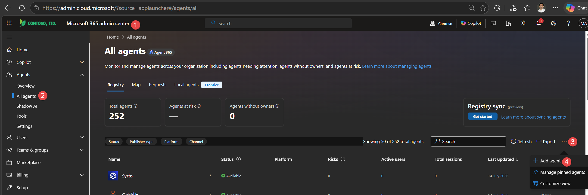

# Agent – Pre-built Copilot Cowork Investment Assessment Agent

## Overview

This is a pre-built declarative agent packaged as a zip file. An admin can import it into Microsoft 365 and make it available to all users in the organisation.

The agent zip file is located at: **[`Agent/Cowork Investment Advisor.zip`](Cowork%20Investment%20Advisor.zip)**

## Import & Deployment Instructions

### Prerequisites

- Microsoft 365 admin access (Global Admin or Teams Admin role)
- Microsoft 365 Copilot licences assigned to target users
- Access to the Microsoft 365 Admin Centre (Agents 365)

### Steps

1. **Download** the file [`Cowork Investment Advisor.zip`](Cowork%20Investment%20Advisor.zip) from the `Agent/` folder in this repository.

2. **Open** the [Microsoft 365 Admin Centre](https://admin.cloud.microsoft.com) ❶ and navigate to **Agents** > **All agents** in the left-hand menu ❷.
    

3. **Click** the **ellipsis menu (...)** in the top-right of the agents list ❸, then select **+ Add agent** ❹.

4. **Upload** the `Cowork Investment Advisor.zip` file. The platform will validate the package contents.

5. **Verify agent details** — review the agent's name, icon, and which products it will work with, then click **Next**.

6. **Select audience** — assign the agent to specific users, groups, or the entire organisation, then click **Next**.

7. **Review permissions and capabilities** — confirm what the agent can access and do, then click **Next**.

8. **Finalise** — click "Finish deployment" to publish the agent.

### Post-Deployment

- It may take up to 24 hours for the agent to appear for all assigned users.
- Users can access the agent from the Copilot agent picker in Microsoft 365 Copilot Chat.
- The agent will appear as "Cowork Investment Advisor" in the agent list.

---

[← Back to Getting Started](../README.md#getting-started)
