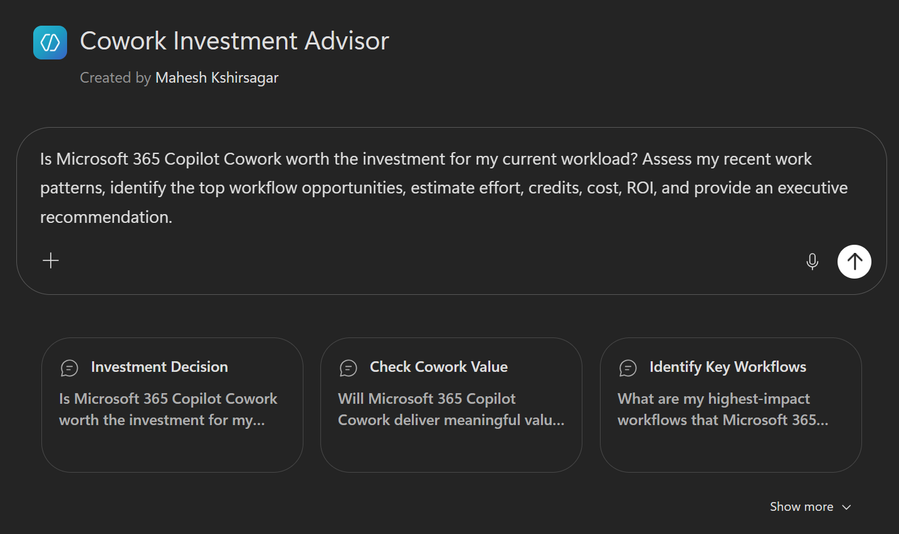
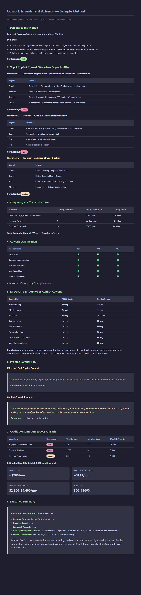

# Copilot Cowork Investment Assessment

A toolkit for evaluating whether [Microsoft 365 Copilot Cowork](https://learn.microsoft.com/en-us/microsoft-365-copilot/extensibility/cowork) is a good fit for a user's workload. It analyses Work IQ signals (emails, meetings, documents, chats, collaboration patterns) to identify high-value workflow automation opportunities, estimate credit consumption, and calculate ROI.

This agent is designed to work alongside the [Customer Cowork Estimator](https://aka.ms/CustomerCoworkEstimator). The estimator handles the core maths once you feed it good inputs — persona, complexity, and expected usage. This agent automates the groundwork of gathering those inputs by reading each user's real work patterns via Work IQ (which is free to access for M365 Copilot agents).

## What It Does

- Identifies a user's persona based on observable work patterns
- Discovers the top 3 workflows suitable for Copilot Cowork orchestration
- Assesses workflow complexity (Light / Medium / Heavy)
- Estimates credit consumption, cost (PAYGO and P3), and ROI
- Compares what Microsoft 365 Copilot vs Copilot Cowork each contribute
- Produces executive-ready recommendations

### Agent Interface



### Sample Output



## Qualification Criteria

Not every workflow belongs in Copilot Cowork. The assessment enforces strict qualification — a workflow must demonstrate **all** of:

1. Multi-step execution (4+ steps)
2. Cross-application orchestration (2+ apps with data flowing between them)
3. Business action execution (record updates, task creation, approvals, routing)
4. Conditional logic (branching, decision points, exception handling)
5. Workflow state management (pending/in-progress/completed tracking)

Workflows that are purely informational (summaries, reports, content generation) are automatically excluded and redirected to Copilot Chat, Pages, or Scheduled Prompts.

## Repository Structure

This repo provides the same agent in three formats — pick the one that matches your role and scenario:

| Folder | Who it's for | Scope | What it does |
|--------|-------------|-------|--------------|
| **`Prompt/`** | Any user with a Copilot licence | Individual | Copy-paste a prompt into Copilot Chat for an immediate one-off assessment |
| **`AgentBuilder/`** | Power users or team leads | Team | Create a reusable agent in M365 Copilot Agent Builder — best for smaller teams who want to share the agent amongst users without admin involvement |
| **`Agent/`** | IT admins | Organisation | Pre-built agent zip ready to import into Agents 365 for org-wide deployment |

```
├── Agent/                  # Pre-built agent package for admin deployment
│   ├── Agent.MD            # Deployment instructions
│   └── Cowork Investment Advisor.zip
│
├── AgentBuilder/           # Manual agent creation via Copilot Agent Builder
│   └── AgentBuilder.MD     # Step-by-step setup (name, description, instructions, starter prompts)
│
├── Prompt/                 # Standalone prompt for direct use
│   └── Prompt.MD           # Full prompt — copy/paste into Microsoft 365 Copilot Chat
│
├── Assets/                 # Screenshots used in documentation
│
└── README.md
```

## Getting Started

Choose the approach that fits your scenario:

| Approach | Use When |
|----------|----------|
| **[Prompt](Prompt/Prompt.MD)** | You want to run the assessment immediately by pasting a prompt into Copilot Chat |
| **[Agent Builder](AgentBuilder/AgentBuilder.MD)** | You want to create a reusable agent in M365 Copilot Agent Builder with starter prompts and knowledge sources |
| **[Agent (Pre-built)](Agent/Agent.MD)** | An admin wants to deploy the agent org-wide via the Microsoft 365 Admin Centre |

Each file includes its own prerequisites and setup details.

## Contributing

This project welcomes contributions and suggestions. Most contributions require you to agree to a
Contributor License Agreement (CLA) declaring that you have the right to, and actually do, grant us
the rights to use your contribution. For details, visit [Contributor License Agreements](https://cla.opensource.microsoft.com).

When you submit a pull request, a CLA bot will automatically determine whether you need to provide
a CLA and decorate the PR appropriately (e.g., status check, comment). Simply follow the instructions
provided by the bot. You will only need to do this once across all repos using our CLA.

This project has adopted the [Microsoft Open Source Code of Conduct](https://opensource.microsoft.com/codeofconduct/).
For more information see the [Code of Conduct FAQ](https://opensource.microsoft.com/codeofconduct/faq/) or
contact [opencode@microsoft.com](mailto:opencode@microsoft.com) with any additional questions or comments.

## Trademarks

This project may contain trademarks or logos for projects, products, or services. Authorized use of Microsoft
trademarks or logos is subject to and must follow
[Microsoft's Trademark & Brand Guidelines](https://www.microsoft.com/legal/intellectualproperty/trademarks/usage/general).
Use of Microsoft trademarks or logos in modified versions of this project must not cause confusion or imply Microsoft sponsorship.
Any use of third-party trademarks or logos are subject to those third-party's policies.
